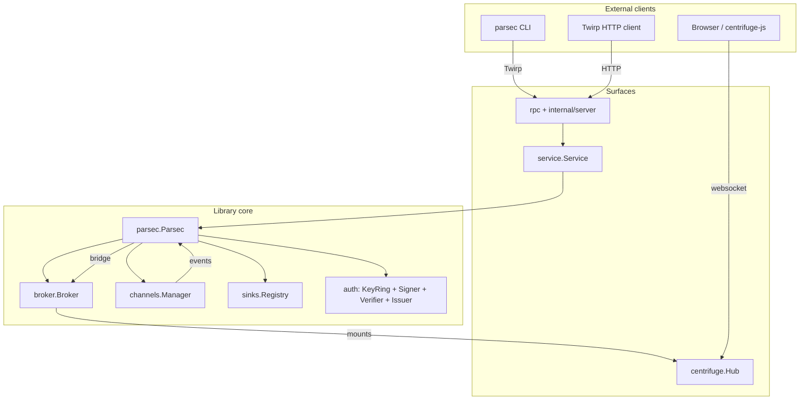

# Architecture overview

Parsec is a library with three parallel surfaces (CLI, Twirp,
websocket). Every surface translates an external call into a
`service.Service` method, which in turn drives the `*parsec.Parsec`
instance.

## The library is the deliverable

`parsec.Parsec` is the unit under test. The CLI binary is one
assembler in `cmd/parsec/main.go` that hands command parsing to
`urfave/cli/v3` and dispatches into `internal/cli/`. The Twirp surface
is a sibling.

Every surface uses the same `service.Service` shim, which is the
surface-agnostic API. The shim exists so the CLI and Twirp handlers
can share their business logic — and so the library callers
(embedders) can pretend the surfaces don't exist.

## Component map

| Package | Responsibility |
|---|---|
| `parsec` | The library facade: `New`, `Run`, `Publish`, `PublishOrSink`, `CreatePrivate`, `RefreshAccess`, key mutation methods. |
| `auth` | HMAC signer / verifier / issuer; keyring; subscribe authorizer for the broker. |
| `broker` | A thin wrapper over `centrifuge.Node`. Owns publish, presence, and the subscribe-authorization hook. |
| `channels` | The name grammar (`ParseName`) and the lifecycle manager (`Manager`) with TTL sweep. |
| `sinks` | The `Sink` interface and registry; ships email/slack/webhook reference implementations. |
| `service` | Surface-agnostic verbs the CLI and Twirp servers call into. |
| `rpc` | Twirp-JSON types, server, client, and bearer middleware. |
| `descriptor` | Manifest envelope (CLI `--json`, `/manifest`). |
| `errors` | The `PARSEC_*` coded error system. |
| `internal/cli` | CLI command bodies. |
| `internal/server` | HTTP mux: Twirp + websocket + SSE + healthz. |
| `cmd/parsec` | `main.go` — assembles the command tree, nothing else. |

## Request flow: a publish

1. Operator runs `parsec publish public:webapp.system.status -d
   '{...}'`.
2. `internal/cli/publish.go` parses flags and calls
   `internal/rpcclient.Publish(...)`.
3. The client posts to
   `/twirp/parsec.ParsecService/Publish` with a mgmt bearer.
4. `internal/server/` routes through the bearer middleware
   (`auth.Verifier`) and into `rpc/server.go`.
5. The RPC server calls `service.Service.Publish(...)`.
6. `service.Service` calls `parsec.Parsec.Publish(...)`.
7. `Parsec.Publish` parses the name, asserts the channel is known to
   the manager, and calls `broker.Broker.Publish`.
8. The broker hands off to `centrifuge.Node.Publish`, which fans the
   message out to every subscriber and records it in history.

## Request flow: a subscribe

1. Browser opens a websocket to `/connection/websocket` with an
   access token.
2. The broker's `OnConnecting` extracts the token and resolves the
   subject.
3. On `SUBSCRIBE`, the broker invokes the
   `SubscribeAuthorizer` that `parsec.New` installed — which
   checks both that the channel is open (`Manager.IsOpen`) AND that
   the token is valid for that channel (`auth.SubscribeAuthorizer`).
4. On success the subscription completes; on failure Centrifuge sends
   the typed error to the client.

## Manager-to-broker bridge

The channel manager emits typed `Event` values on every lifecycle
transition; `parsec.Parsec.runEventBridge` translates them:

| Event | Broker action |
|---|---|
| `EventOpened` | Nothing — `Manager.IsOpen` already returns true. |
| `EventClosed` (public, TTL exceeded) | Nothing — existing subscribers drain. |
| `EventDeleted` | `broker.UnsubscribeAll(name)` — kick every connected subscriber. |

That asymmetry is the single most important rule in the codebase:
`closed != deleted`. See [TTL and expiry](../channels/ttl.md).

## See also

- [Broker internals](broker.md).
- [Channel manager internals](channels.md).
- [Library overview](../library/overview.md).
